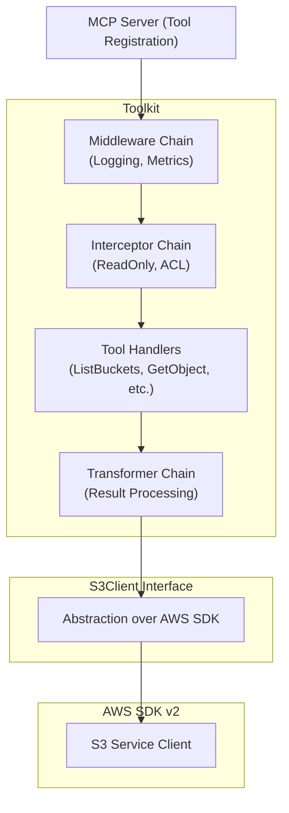
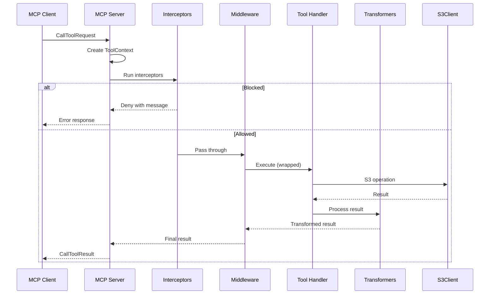

# Architecture

Understanding the internal architecture of mcp-s3.

## Layer Overview



## Key Components

### Toolkit

The `Toolkit` is the central component that:

- Holds references to S3 clients
- Manages middleware, interceptors, and transformers
- Provides tool registration to MCP servers
- Handles multi-connection support

### S3Client Interface

The `S3Client` interface abstracts S3 operations:

```go
type S3Client interface {
    ConnectionName() string
    ListBuckets(ctx context.Context) ([]BucketInfo, error)
    ListObjects(ctx context.Context, bucket, prefix, delimiter string, maxKeys int32, continueToken string) (*ListObjectsOutput, error)
    GetObject(ctx context.Context, bucket, key string) (*ObjectContent, error)
    GetObjectMetadata(ctx context.Context, bucket, key string) (*ObjectMetadata, error)
    PutObject(ctx context.Context, input *PutObjectInput) (*PutObjectOutput, error)
    DeleteObject(ctx context.Context, bucket, key string) error
    CopyObject(ctx context.Context, input *CopyObjectInput) (*CopyObjectOutput, error)
    PresignGetURL(ctx context.Context, bucket, key string, expires time.Duration) (*PresignedURL, error)
    PresignPutURL(ctx context.Context, bucket, key string, expires time.Duration) (*PresignedURL, error)
    Close() error
}
```

### ToolContext

The `ToolContext` carries request-scoped data through the processing chain:

```go
type ToolContext struct {
    ToolName       string
    ConnectionName string
    RequestID      string
    // Plus arbitrary key-value storage
}
```

## Request Flow



## Configuration Flow

```go
// 1. Create S3 client
s3Client, _ := client.New(ctx, &cfg)

// 2. Create toolkit with options
toolkit := tools.NewToolkit(s3Client,
    tools.WithMiddleware(middleware...),
    tools.WithInterceptor(interceptors...),
    tools.WithTransformer(transformers...),
)

// 3. Register with MCP server
toolkit.RegisterTools(mcpServer)
```
