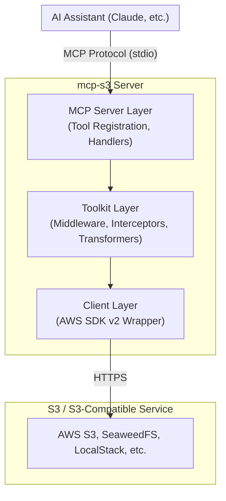

# Server Overview

mcp-s3 runs as a standalone MCP server that provides S3 operations to AI assistants through the Model Context Protocol.

## How It Works

1. **MCP Transport**: The server communicates via stdio, making it compatible with any MCP client
2. **Tool Registration**: S3 operations are exposed as MCP tools that AI assistants can call
3. **AWS SDK**: Uses the official AWS SDK v2 for reliable S3 operations
4. **Extensions**: Built-in middleware provides logging, metrics, and access control

## Architecture

## Safety Features

mcp-s3 is designed with safety as a priority:

- **Read-Only Default**: Write operations (put, delete, copy) are blocked by default
- **Size Limits**: Maximum object sizes for get (10MB) and put (100MB) operations
- **No Credential Exposure**: Credentials are never exposed through MCP tools

## Use Cases

- **Data Exploration**: Browse and read files in S3 buckets
- **Content Analysis**: Retrieve documents, logs, or data files for AI analysis
- **File Management**: Upload, copy, and organize files (when write is enabled)
- **URL Generation**: Create temporary presigned URLs for sharing
